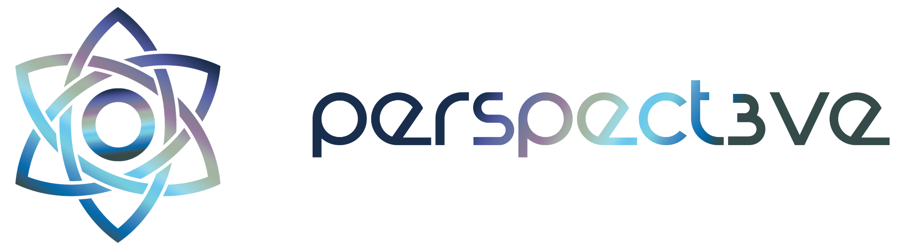
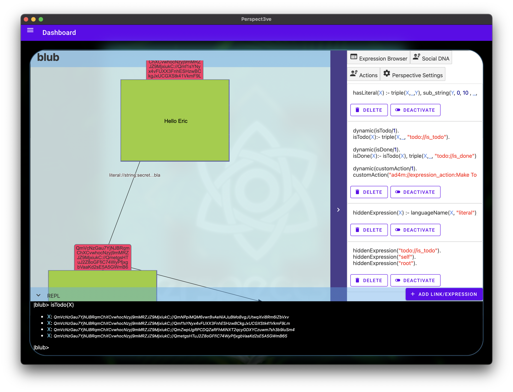

# Perspect3ve - The general purpose AD4M UI, browser and group collaboration tool

**WIP and under heavy development**

This is an agent-centric browser and example usage of AD4M. Its a desktop GUI application that provides means for creating Perspectives and creating and linking expressions inside these Perspectives. 

One central intention with this tool is to make the concepts of AD4M and Perpect3vism accessible graphically and in a generic way to the user directly.

While other AD4M apps may provide a more specific interface to the user's Perspectives, the same data can always be viewed in a generic way through Perspect3ve.

Since AD4M already includes group semantics and spaces on a low level as Neighbourhoods, Perspect3ve is also a very generic social app and group collaboration tool.

## Features

- [x] CRUD Perspectives
- [x] Graph based Perspective view
- [x] Creation and linking of Expressions
- [x] Publishing of Perspectives as Neighbourhoods
- [ ] Joining of Neighbourhoods 
- [x] CRUD for Social DNA Prolog rules
- [x] CRUD for custom Expression actions
- [x] Perspective based Prolog REPL
- [x] Filtering of Expressions through predicate `hiddenExpression(X)`
- [ ] Custom Icons (Expression widget replacement)
- [ ] Virtual Icons (widgets representing graph patterns)
- [ ] Peer/Friends view
- [ ] Direct messaging with Peers/Friends
- [ ] "Canonical" Neighbourhood view
- [ ] CRUD Social Organisms




## Build

Everything, including the needed Holochain binaries, gets build with:

```
npm install
npm run build
```

**but Nix (nix-shell) is required!**

The post-install hook creates a symlink to the `default.nix` file in `node_modules/@perspect3vism/ad4m-executor` (so we always build the Holochain version that ad4m-executor runs with) and builds those derivations. *On first run, this can take a long time.* **To speed this up, you can use our Nix cache at Cachix. [See instructions here.](https://app.cachix.org/cache/perspect3vism#pull)**
Then running `create-hc-symlinks.sh` in that nix-shell will create links in the repo root to the binaries in the local nix-cache so the app can start without having to enter nix-shell again.
(If you change the version of ad4m-executor in the dependencies you might have to rerun `npm run create-symlinks` manually).

`npm run build` will build the app (the UI) itself and download specified builds of AD4M languages.

## Run
```
npm start
```
or
```
npm run dev
```

## Attributions
[Splash background vector created by pikisuperstar - www.freepik.com](https://www.freepik.com/vectors/background)